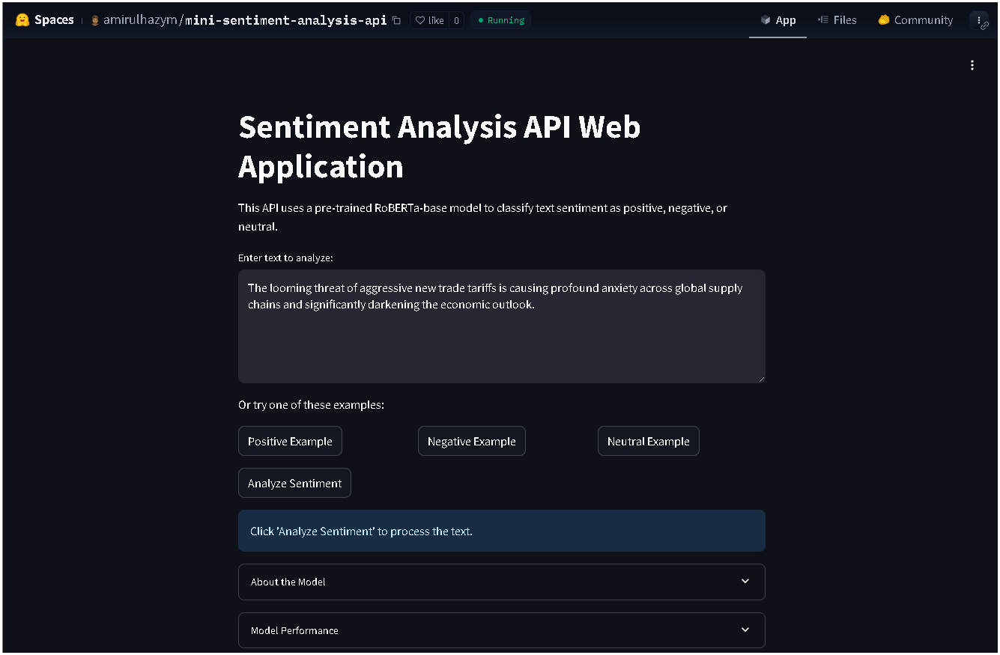

# Sentiment Analysis Web Application with RoBERTa and Streamlit

[](https://huggingface.co/spaces/amirulhazym/mini-sentiment-analysis-api)
[](https://opensource.org/licenses/MIT)
[](https://www.python.org/downloads/release/python-3110/)

## Overview
This project is a web-based sentiment analysis application that classifies text as **Positive**, **Negative**, or **Neutral** using the `cardiffnlp/twitter-roberta-base-sentiment` RoBERTa model from Hugging Face. Built with **Streamlit** and deployed on **Hugging Face Spaces**, it offers a responsive interface for real-time analysis, ideal for customer feedback in Malaysia’s fintech (e.g., Grab, CIMB) and e-commerce (e.g., Shopee, Lazada) sectors. The project demonstrates skills in **NLP**, **model deployment**, and **web development**, aligning with Malaysia’s MyDIGITAL and Singapore’s Smart Nation initiatives.

## Live Demo
### Link: [Try the application here](https://huggingface.co/spaces/amirulhazym/mini-sentiment-analysis-api)


## Features
- **Real-Time Sentiment Classification**: Analyzes text with confidence scores and visual feedback (progress bar, bar chart).
- **Interactive UI**: Includes example buttons for Positive, Negative, and Neutral inputs, plus a text area for custom text.
- **Optimized Performance**: Uses `@st.cache_resource` for efficient model loading.
- **Error Handling**: Validates input length (max 512 words) and provides user-friendly error messages.
- **Model Insights**: Expandable sections detail the RoBERTa model and performance metrics.

## Project Structure
```
sentiment-analysis-api/
├── app.py              # Streamlit application code
├── requirements.txt    # Python dependencies
├── README.md           # Project documentation
├── .gitignore          # Git ignore file
└── test_model.py       # Model evaluation script
```

## Installation
Follow these steps to run the application locally:

1. **Clone the Repository**:
  ```
  git clone https://github.com/amirulhazym/sentiment-analysis-api.git
  cd sentiment-analysis-api
  ```
3. **Set Up a Virtual Environment**:
  ```
  python -m venv sa-env
  .\sa-env\Scripts\activate
  ```
  or
  ```
  python -m venv sa-env
  source sa-env/bin/activate # On macOS/Linux
  ```
3. **Install Dependencies**:
  ```
  pip install -r requirements.txt
  ```
4. **The requirements.txt includes**:
  ```
  streamlit==1.39.0
  transformers==4.45.2
  torch==2.4.1+cpu
  numpy==1.26.4
  scipy==1.14.1
  datasets==3.0.1
  ```
5. **Run the Application**:
  ```
  streamlit run app.py
  ```
  Access at http://localhost:8501.

## Usage
- Access the App: Open the live demo or run locally.
- Input Text: Enter text in the text area or click example buttons (Positive, Negative, Neutral).
- Analyze Sentiment: Click “Analyze Sentiment” to view the classification, confidence score, progress bar, and bar chart.
- Explore Model Details: Expand “About the Model” or “Model Performance” for insights.

## Model Details
- Model: cardiffnlp/twitter-roberta-base-sentiment (RoBERTa-base)
- Training Data: ~58M tweets, fine-tuned on the TweetEval benchmark
- Classes: Negative (LABEL_0), Neutral (LABEL_1), Positive (LABEL_2)
- Source: Hugging Face Model Card
- Limitations: Optimized for short, English, Twitter-like texts; performance on long texts or Bahasa Malaysia (e.g., “Saya suka produk ini!” misclassified as Neutral) may vary.

## Performance Metrics
Accuracy: ~70% on 100 samples from the tweet_eval test set (evaluated in app.py).
Note: Limited testing due to 1-day project constraint; precision/recall analysis pending further evaluation.

## Relevance to Malaysia/Singapore
This application supports sentiment analysis for customer feedback, a growing need in Malaysia’s fintech and e-commerce sectors (20% of AI/ML roles, per Jobstreet Report 2024). It aligns with Malaysia’s MyDIGITAL initiative and Singapore’s Smart Nation goals, showcasing skills in NLP, model deployment, and UI development critical for roles like OOm’s AI/ML Engineer.

## Limitations
- Single-Text Input: No batch processing support.
- Language Constraint: Suboptimal performance on Bahasa Malaysia or non-English texts.
- Domain Specificity: May require fine-tuning for Malaysian social media contexts.

## Future Improvements
- Fine-tune the model on Malaysia-specific datasets (e.g., Malay tweets from AirAsia).
- Add multilingual support for Bahasa Malaysia and Mandarin.
- Implement batch input processing for scalability.
- Integrate a user feedback mechanism for continuous improvement.

## Deployment
The application is deployed on Hugging Face Spaces:

Steps:
- Created a Space with Streamlit SDK.
- Uploaded app.py and requirements.txt.
- Linked to this GitHub repository for automatic updates.
- Resolved build issues (e.g., removed ipython==9.1.0 dependency).
- Live URL: https://huggingface.co/spaces/amirulhaz/sentiment-analysis-api

## Credits
- Hugging Face: For the cardiffnlp/twitter-roberta-base-sentiment model.
- Streamlit: For the web interface framework.
- PyTorch: For the deep learning backend.
- TweetEval: Barbieri, F. et al. (2020). TweetEval: Unified Benchmark for Tweet Classification. EMNLP.

## Contributing
Contributions are welcome! Please:

- Fork the repository.
- Create a feature branch (git checkout -b feature/YourFeature).
- Commit changes (git commit -m 'Add YourFeature').
- Push to the branch (git push origin feature/YourFeature).
- Open a Pull Request.

## License
This project is licensed under the MIT License.

## Author
Amirulhazym

AI/ML Enthusiast | UTM Electrical & Electronic Engineering Graduate

LinkedIn | GitHub | Portfolio

© 2025 Amirulhazym
